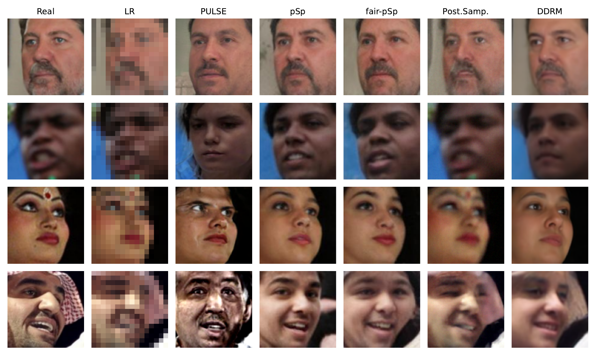

# [ACM FAccT 2024] Benchmarking the Fairness of Image Upsampling Methods

This repository contains the code for reproducing the experiments in the paper [Benchmarking the Fairness of Image Upsampling Methods](https://arxiv.org/pdf/2401.13555.pdf) by Mike Laszkiewicz, Imant Daunhawer, Julia E. Vogt, Asja Fischer, and Johannes Lederer.

This paper has been accepted at ACM FAccT 2024.

> Recent years have witnessed a rapid development of deep generative models for creating synthetic media, such as images and videos. While the practical applications of these models in everyday tasks are enticing, it is crucial to assess the inherent risks regarding their fairness. In this work, we introduce a comprehensive framework for benchmarking the performance and fairness of conditional generative models. We develop a set of metrics—inspired by their supervised fairness counterparts—to evaluate the models on their fairness and diversity. Focusing on the specific application of image upsampling, we create a benchmark covering a wide variety of modern upsampling methods. As part of the benchmark, we introduce UnfairFace, a subset of FairFace that replicates the racial distribution of common large-scale face datasets. Our empirical study highlights the importance of using an unbiased training set and reveals variations in how the algorithms respond to dataset imbalances. Alarmingly, we find that none of the considered methods produces statistically fair and diverse results.




# Installation 
All experiments were conducted using `Python 3.9.18` on an `Ubuntu 20.04` machine and the environment can be installed using the provided `requirements.txt`: 
```
pip install -r requirements.txt
```

# Setup 
For setting up the experiments, we must store the
1. FairFace test dataset and the corresponding labels; 
2. race classifiers trained on FairFace; 
3. outputs of the image upsample algorithms, i.e., the upsampled reconstructions. 

### 1. FairFace Dataset 
Based on the [original FairFace dataset](https://github.com/joojs/fairface), we select the test dataset as described in Section 4 of the paper. Furthermore, we require the corresponding labels and the average faces for evaluating the diversity. The processed data can be downloaded [here](https://ruhr-uni-bochum.sciebo.de/s/nLTcWsfJuFJ3FH8) and should be stored according to the following structure: 
```
data
└──fairface
    ├── avg_faces
    ├── avg_noisy_faces
    ├── test_correct_prediction
    └── fairface_label_val.csv

```

### 2. Race Classifier
In our experiments, we employ the pre-trained race classifier from the [FairFace repository](https://github.com/dchen236/FairFace). It should be stored as `models/race_prediction/res34_fair_align_multi_7_20190809.pt`

### 3. Upsampled Reconstructions
The upsampled images can be downloaded [here](https://ruhr-uni-bochum.sciebo.de/s/M83uuJL8wuwCsY6). 
Alternatively, you can recompute the reconstructions on your machine. Below, we provide the upsampling models pre-trained on FairFace and UnfairFace and an explanation on how to deploy these models. 

The images must be stored in `upsampled_imgs` following the given structure: 
```
upsampled_imgs
└──fairface
    └── 4_to_128
        ├── ddrm
        ├── fairpsp
        ...
    └── 4noise_to_128
        ├── ddrm
        ├── fairpsp
        ...
    └── 16_to_128
        ├── ddrm
        ├── fairpsp
        ...
└──unfairface
    └── 4_to_128
        ├── ddrm
        ├── fairpsp
        ...
    └── 4noise_to_128
        ├── ddrm
        ├── fairpsp
        ...
    └── 16_to_128
        ├── ddrm
        ├── fairpsp
        ...
```

# Running the Experiments
All experiments can be reproduced by running the `empirical_evaluation.ipynb` notebook.


# Pretrained Models
In our experiments, we evaluate PULSE, pSp, Fair-pSp, posterior Sampling, and DDRM trained on FairFace and UnfairFace. Specifically, these methodes require 
- StyleGAN2 backbones for applying PULSE;
- the encoders for pSp and Fair-pSp;
- the NCSNv2 models for running posterior Sampling ;
- and a DDPM backbone for implementing DDRM.

All models can be downloaded [here](https://ruhr-uni-bochum.sciebo.de/s/PpVolx8XPzRFylI). To deploy these models, we use the official repositories: 
- [PULSE](https://github.com/adamian98/pulse)  
- [pSp](https://github.com/eladrich/pixel2style2pixel)
- [Fair-pSp](https://github.com/MikeLasz/Fair-pSp) (There is no official repository of Fair-pSp. This repository is our reimplementation of the approach.)
- [Posterior Sampling](https://github.com/ajiljalal/code-cs-fairness)
- [DDRM](https://github.com/bahjat-kawar/ddrm)

# UnfairFace 
For evaluting your own model using the proposed benchmark, you need to train the upsampling model on FairFace and UnfairFace. UnfairFace is a processed and filtered version of FairFace and can be accessed [here](https://ruhr-uni-bochum.sciebo.de/s/eWzVGs5lMgMVgW8). For further details on UnfairFace, we refer to Section 3 of the paper. 

# Citation 
If you find this repository useful, please consider citing the preprint of our paper:
```
@article{laszkiewicz2024benchmarking,
  title={Benchmarking the Fairness of Image Upsampling Methods},
  author={Laszkiewicz, Mike and Daunhawer, Imant and Vogt, Julia E and Fischer, Asja and Lederer, Johannes},
  journal={arXiv preprint arXiv:2401.13555},
  year={2024}
}
```